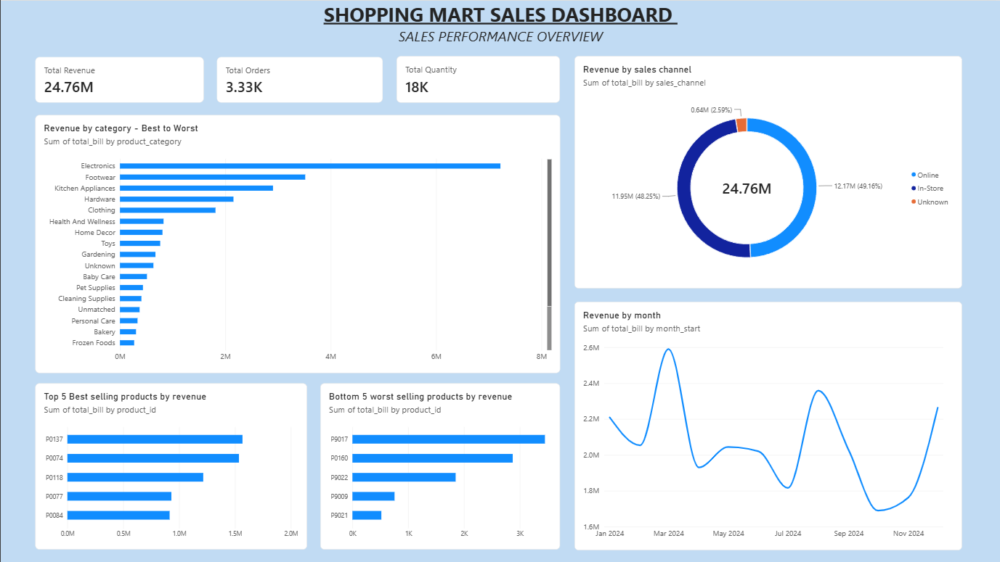

# ShoppingMart Analysis

A data analysis project based on ShoppingMart sales data, covering data analysis, insights, and an interactive Power BI dashboard.

## Project Overview

This project analyzes ShoppingMart sales data to identify sales trends, category performance, product performance, and sales channel contribution.

## 📊 Power BI Dashboard

## Tasks Completed

### Task 1 – Data Analysis

- Data exploration and analysis using Python
- Data cleaning and preparation
- Analysis of sales-related metrics
- Insights derived from the dataset

### Task 2 – Power BI Dashboard

Created an interactive Power BI dashboard covering:

- Total Revenue
- Total Orders
- Total Quantity
- Revenue by Category
- Revenue by Month
- Revenue by Sales Channel
- Top 5 Best-Selling Products
- Bottom 5 Worst-Selling Products

## Tools & Technologies

- Python
- Pandas
- Jupyter Notebook
- Power BI
- Excel

## Repository Files

| File | Description |
|---|---|
| `Project1.ipynb` | Python/Jupyter Notebook for Task 1 |
| `task1.pdf` | Task 1 report/output |
| `task2.pbix` | Power BI dashboard for Task 2 |

## Dashboard

The Power BI dashboard provides an overview of ShoppingMart sales performance through KPIs and visualizations.

## 🔍 Key Insights

- Electronics generated the highest revenue among the product categories.
- Revenue varied significantly across months, showing clear monthly fluctuations.
- Online and In-Store channels contributed the majority of total revenue.
- The dashboard highlights the top and bottom performing products based on revenue.

## Author

Shreyas Kulkarni
